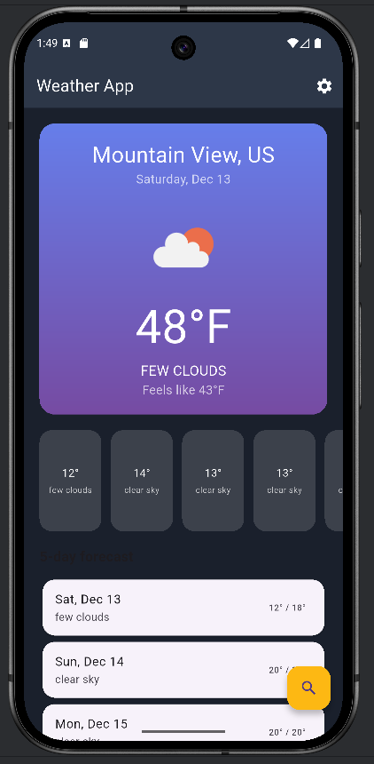
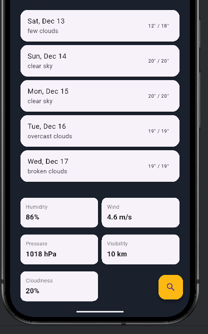
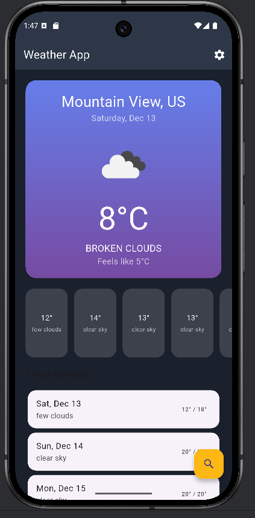
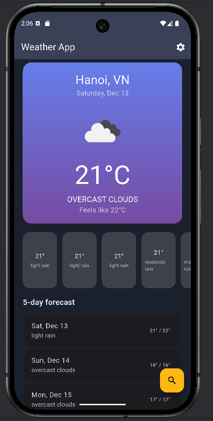
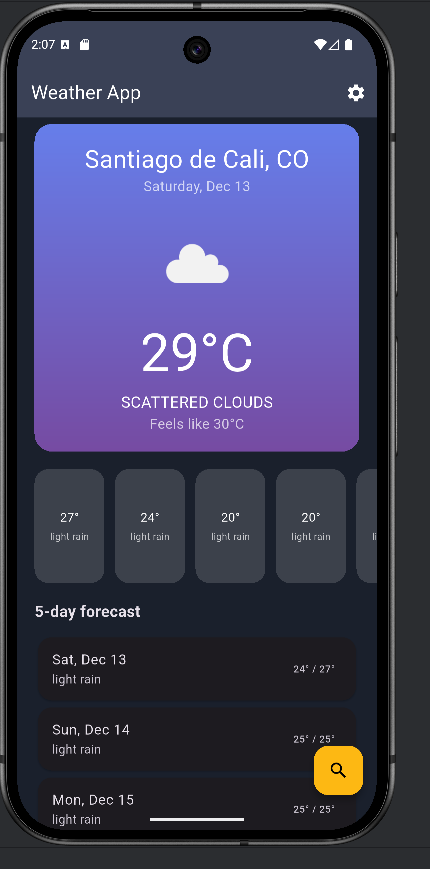

# 🌦️ Ứng dụng Thời Tiết Flutter – *thoitietapp*

Ứng dụng Flutter hiển thị **thời tiết theo thời gian thực** từ OpenWeatherMap API, hỗ trợ tìm kiếm thành phố, dự báo 5 ngày, định vị GPS, chế độ offline và màn hình cài đặt đầy đủ.

---

## 📌 Mục lục

- [Giới thiệu](#-giới-thiệu)
- [Tính năng](#-tính-năng)
- [Kiến trúc & Công nghệ](#-kiến-trúc--công-nghệ)
- [Screenshots](#-screenshots)
- [Cài đặt & Chạy ứng dụng](#-cài-đặt--chạy-ứng-dụng)
- [Cấu trúc thư mục](#️-cấu-trúc-thư-mục)
- [Hướng phát triển](#-hướng-phát-triển)
- [Thông tin sinh viên](#-thông-tin-sinh-viên)

---

## 🌟 Giới thiệu

`thoitietapp` là một ứng dụng Flutter giúp người dùng:

- Xem thời tiết hiện tại theo vị trí GPS hoặc tên thành phố
- Xem dự báo theo giờ và dự báo 5 ngày
- Lưu thành phố yêu thích
- Xem lịch sử tìm kiếm
- Hoạt động offline nhờ cơ chế cache
- Cho phép đổi đơn vị trong Settings

---

## 🚀 Tính năng

### 🌤️ Thời tiết hiện tại
- Nhiệt độ, feels like
- Mô tả thời tiết + icon
- Humidity, wind speed, visibility
- Cloudiness & pressure
- UI gradient theo điều kiện thời tiết

### ⏳ Dự báo
- Hourly forecast
- 5-day forecast
- Nhiệt độ min/max + mô tả

### 📍 Định vị GPS
- Lấy vị trí hiện tại
- Tự động load thời tiết theo location

### 🔍 Tìm kiếm & Yêu thích
- Tìm kiếm theo tên thành phố
- Lưu tối đa 5 thành phố yêu thích
- Hiển thị lịch sử tìm kiếm

### 💾 Offline Support
- Tự động lưu cache thời tiết
- Sử dụng khi offline

### ⚙️ Settings
- Celsius (°C) ↔ Fahrenheit (°F)
- m/s ↔ km/h ↔ mph
- 12h ↔ 24h
- Lưu cài đặt bằng SharedPreferences

---

## 🏗️ Kiến trúc & Công nghệ

| Công nghệ | Mô tả |
|----------|-------|
| Flutter | UI framework |
| Dart | Ngôn ngữ chính |
| Provider | State management |
| http | Gọi API |
| geolocator | Lấy vị trí |
| shared_preferences | Cache offline |
| flutter_dotenv | Bảo mật API key |
| intl | Format ngày giờ |
| cached_network_image | Tải icon thời tiết |

---

## 📸 Screenshots

### Bảng hình ảnh minh họa giao diện

| Ảnh | Mô tả |
|-----|-------|
|  | 🌞 Home – Trời nắng, UI gradient sáng |
|  | 🌧️ Home – Trời mưa / nhiều mây |
|  | 📅 Dự báo thời tiết 5 ngày |
|  | 🔍 Tìm kiếm – Thủ Dầu Một |
|  | 📌 Giao diện tìm kiếm chung |
|  | 🇻🇳 Thời tiết Hà Nội |
|  | 🏙️ Thời tiết TP Hồ Chí Minh |
|  | ⚙️ Màn hình Settings |

---

## ⚙️ Cài đặt & Chạy ứng dụng

### 1️⃣ Cài dependencies
Thông tin sinh viên

Họ tên: [Lê Xuân trường]

MSSV: [2224801030263]

Lớp: [d22ktpm01]
```bash
flutter pub get
flutter run
lib/
  main.dart
  config/
    api_config.dart
  models/
    weather_model.dart
    forecast_model.dart
  services/
    weather_service.dart
    location_service.dart
    storage_service.dart
  providers/
    weather_provider.dart
    settings_provider.dart
  screens/
    home_screen.dart
    search_screen.dart
    settings_screen.dart
  widgets/
    current_weather_card.dart
    hourly_forecast_list.dart
    daily_forecast_card.dart
    loading_shimmer.dart
    error_widget_custom.dart
    weather_detail_item.dart

screenshot/
  home_sunny.png
  home_rainy.png
  HaNoiVn.png
  satiado.png
  ForecastScreen.png
  searchcity.png
  search_screen_thudau mot.png
  setting.png
